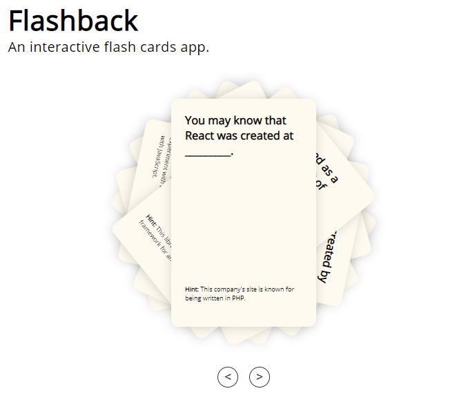

# Flashback

This is a single-page-app that provides introductory information about React.

One can navigate left and right (using the arrows) to access the cards. Clicking on the card on top would flip the card and reveal additional details (along with a picture) on the back of the card.  

## Live app is available [here](https://flashback-raj-mukerjee.herokuapp.com/).

## Tools & Resources

* [ReactJS](https://reactjs.org/docs/getting-started.html) 

Thanks for visiting!